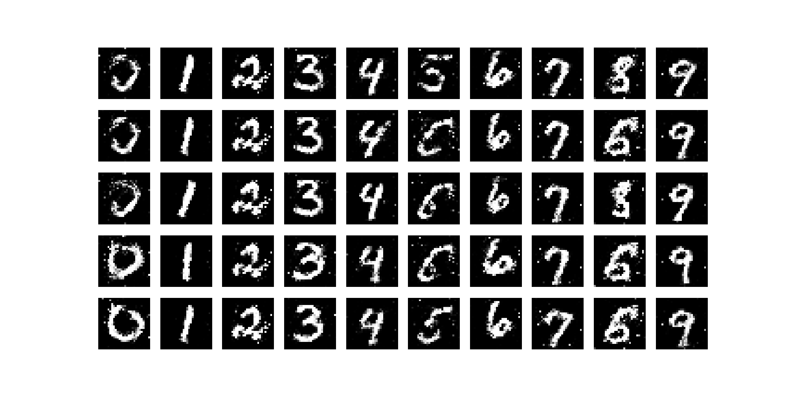

# Simple conditional GAN in Keras

Author: Alejandro Pozas Kerstjens

Implementation of a simple conditional
[Generative Adversarial Network](https://arxiv.org/abs/1406.2661). The condition allows to specify
properties of the desired output during the generation of new instances. An example is provided with
the MNIST dataset.

Libraries required:
- [keras](https://github.com/fchollet/keras) as DL framework (needs either
[tensorflow](https://www.tensorflow.org/) or [theano](http://deeplearning.net/software/theano/)
installed)
- [numpy](http://www.numpy.org/) for math operations
- [matplotlib](https://matplotlib.org/) for image visualization
- [tqdm](https://pypi.python.org/pypi/tqdm) for progress bar

## Example
